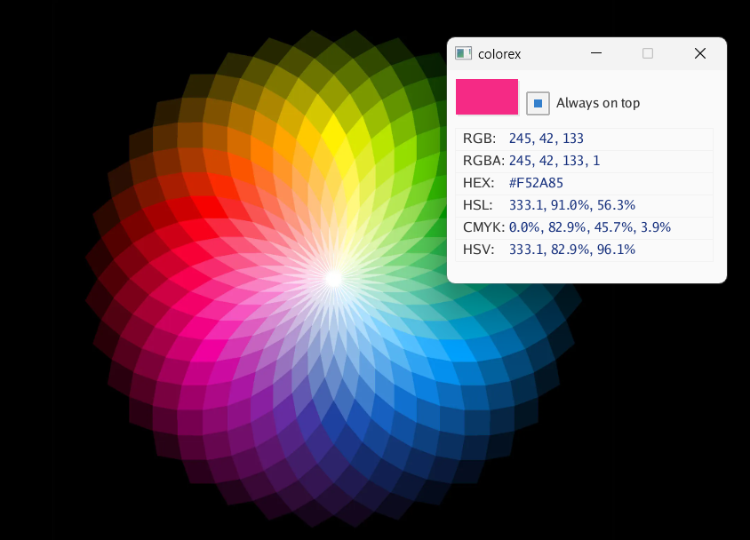

# colorex

colorex is a tool that captures colors from your screen and displays them in various color formats (RGB, RGBA, HEX, HSL, CMYK, HSV).

## Features

- Real-time color capture from screen
- Color display in RGB, RGBA, HEX, HSL, CMYK, and HSV formats
- Copy color values to clipboard
- Always on top option



## Installation

### Windows
1. [Download the latest release](https://github.com/seukaiwokeo/colorex/releases/latest)
2. Run `colorex-windows.exe`

## Usage

- After starting the program, it will automatically capture the color under your mouse cursor
- Click on any color value to copy it to clipboard
- Check the "Always on top" option to keep the window on top of other windows
- Use SPACE key to pause/resume the program

## Development

To develop the project:

1. Clone the repository
```bash
git clone https://github.com/yourusername/colorex.git
cd colorex
```

2. Install dependencies
```bash
go mod download
```

3. Build the project
```bash
go build
```

## License

MIT License
